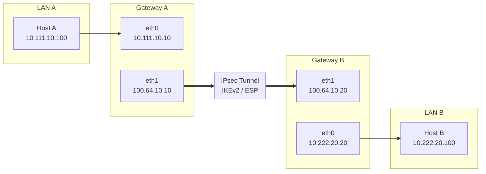

# StrongSwan Site-to-Site VPN Lab

Laboratório de rede que simula uma VPN Site-to-Site entre duas LANs isoladas, usando StrongSwan (IKEv2 + ESP) sobre containers Docker.

O objetivo foi reproduzir, em ambiente controlado, um cenário comum em redes corporativas: interligar duas filiais através de um túnel IPsec, com todo o roteamento e a negociação de segurança feitos manualmente, sem soluções prontas de nuvem ou appliances comerciais.


---

## Topologia



| Dispositivo | Interface | Endereço        |
|-------------|-----------|-----------------|
| Host A      | eth0      | 10.111.10.100   |
| Gateway A   | LAN       | 10.111.10.10    |
| Gateway A   | WAN       | 100.64.10.10    |
| Gateway B   | WAN       | 100.64.10.20    |
| Gateway B   | LAN       | 10.222.20.20    |
| Host B      | eth0      | 10.222.20.100   |

---

## Como funciona

1. Host A envia tráfego destinado à rede remota (LAN B).
2. Gateway A identifica que o tráfego corresponde a uma política IPsec configurada.
3. O pacote é encapsulado e criptografado via ESP.
4. O pacote criptografado atravessa a rede WAN (não confiável).
5. Gateway B decripta o pacote e o encaminha para a rede local.
6. O pacote chega ao Host B como se estivesse na mesma rede.

Todo o tráfego entre as duas LANs trafega criptografado — a rede WAN nunca vê os dados em texto claro.

---

## Stack utilizada

- Docker / Docker Compose
- Ubuntu 24.04
- StrongSwan (IKEv2, ESP)
- Roteamento e IP forwarding no Linux
- Bash (scripts de automação)

---

## Estrutura do projeto

```
.
├── docker-compose.yml
├── gateway-a/
│   ├── Dockerfile
│   └── config/
│       ├── ipsec.conf
│       └── ipsec.secrets.example
├── gateway-b/
│   ├── Dockerfile
│   └── config/
│       ├── ipsec.conf
│       └── ipsec.secrets.example
├── host-a/
│   └── Dockerfile
├── host-b/
│   └── Dockerfile
├── scripts/
│   ├── deploy.sh
│   ├── cleanup.sh
│   └── test.sh
├── docs/
└── images/
```

---

## Pré-requisitos

- Docker Engine
- Docker Compose
- Linux (testado em Ubuntu)

---

## Executando o laboratório

Clonar o repositório:

```bash
git clone https://github.com/czsrmx/strongswan-site-to-site-vpn.git
cd strongswan-site-to-site-vpn
```

Construir as imagens:

```bash
docker compose build
```

Subir os containers:

```bash
docker compose up -d
```

Iniciar o StrongSwan em cada gateway:

```bash
docker exec gateway-a ipsec start
docker exec gateway-b ipsec start
```

Verificar o status da VPN:

```bash
docker exec gateway-a ipsec status
docker exec gateway-b ipsec status
```

---

## Validando o túnel

**Teste de conectividade** (Host A → Host B, através do túnel):

```bash
docker exec host-a ping -c 4 10.222.20.100
```

Saída esperada:

```
4 packets transmitted, 4 received, 0% packet loss
```

**Status das Security Associations:**

```bash
docker exec gateway-a ipsec statusall
```

Deve mostrar `IKEv2 established`, `ESP installed` e o túnel ativo.

**Políticas IPsec instaladas no kernel:**

```bash
docker exec gateway-a ip xfrm state
```

Exibe as SAs de ESP negociadas e instaladas.

---

## O que este projeto demonstra

- Configuração de VPN Site-to-Site com StrongSwan
- Negociação IKEv2 e criptografia ESP
- Roteamento entre redes isoladas e IP forwarding no Linux
- Design de topologia de rede com Docker
- Automação de deploy com Bash
- Diagnóstico e troubleshooting de túneis IPsec

---

## Próximos passos

- [ ] Autenticação baseada em certificados (X.509)
- [ ] Roteamento dinâmico com FRRouting (OSPF/BGP)
- [ ] Regras de firewall com nftables
- [ ] Monitoramento com Prometheus + Grafana
- [ ] Alta disponibilidade com Keepalived
- [ ] Pipeline de CI/CD (GitHub Actions)
- [ ] Testes automatizados de validação do túnel
- [ ] Capturas de pacotes com Wireshark documentadas

---

## Licença

Distribuído sob licença MIT. Veja `LICENSE` para mais detalhes.

## Autor

**Daniel Ramos**
Estudante de Ciência da Computação, com foco em Redes, Cibersegurança, Linux e Infraestrutura.

- GitHub: [github.com/czsrmx](https://github.com/czsrmx)
- LinkedIn: (https://www.linkedin.com/in/daniel-ramos-6759a133a/)

---

Se este projeto foi útil, considere deixar uma estrela  no repositório.
