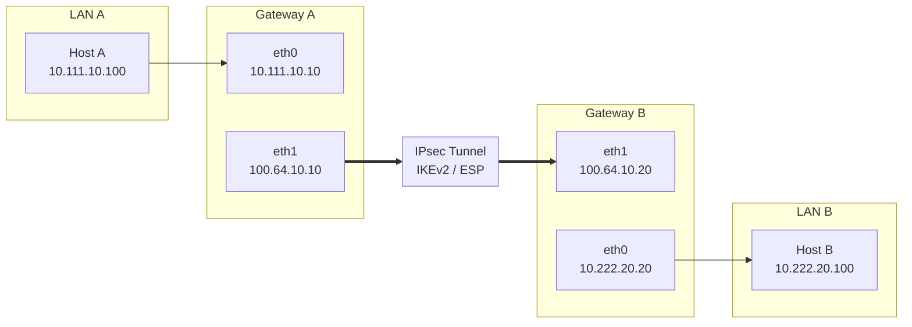

```mermaid
flowchart LR

subgraph LAN_A["LAN A"]
    HA[Host A<br/>10.111.10.100]
end

subgraph GW_A["Gateway A"]
    GA1[eth0<br/>10.111.10.10]
    GA2[eth1<br/>100.64.10.10]
end

subgraph VPN["IPsec Tunnel<br/>IKEv2 / ESP"]
end

subgraph GW_B["Gateway B"]
    GB1[eth1<br/>100.64.10.20]
    GB2[eth0<br/>10.222.20.20]
end

subgraph LAN_B["LAN B"]
    HB[Host B<br/>10.222.20.100]
end

HA --> GA1
GA2 ==> VPN ==> GB1
GB2 --> HB
```
